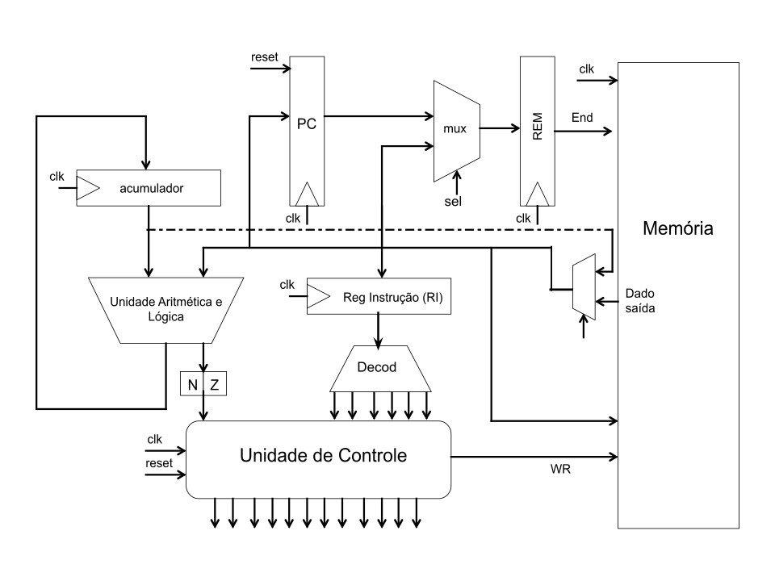

# INF01175-NEANDER++
Neander++ (Neander with some extensions) __implementation__ and __testing__ in VHDL for Digital Systems' 2nd assignment.  
[Neander](http://www.inf.ufrgs.br/arq/wiki/doku.php?id=neander) is an one accumulator hypothetical processor architecture created by Professor Raul Weber.

### Neander++ ISA
- 8 bits data and address width
- 2's complement data representation
- 8 bits accumulator (AC)
- 8 bits program counter (PC)
- 1 state registers for 2 conditional codes: 'N' for negative value and 'Z' for zero value

|Code|Instruction|Operation Description|
|-|-|-|
|0000|`NOP`|No operation|
|0001|`STA addr`|Stores accumulator (`AC`) value under the memory's address refered by `addr`|
|0010|`LDA addr`|Loads the value of memory's addresss `addr` under the accumulator `AC`|
|0011|`ADD addr`|Sums the value of the mem's `addr` to the `AC` value|
|0100|`OR addr`|"OR" operation over the value of the mem's `addr` to the `AC` value|
|0101|`AND addr`|"AND" operation over the value of the mem's `addr` to the `AC` value|
|0110|`NOT`|Inverts the `AC` value's bits|
|0111*|`SUB addr`|Subtracts the value of the mem's `addr`  to the `AC` value|*
|1000|`JMP addr`|Unconditional Jump to mem's address `addr`|
|1001|`JN addr`|Conditional Jump to mem's address `addr` if "N=1"|
|1010|`JZ addr`|Conditional Jump to mem's address `addr` if "Z=1"|
|1011*|`XOR addr`|"XOR" operation over the value of the mem's `addr` to the accumulator value|
|1111|`HLT`|Halt|

_\* This operation wasn't defined in the original Neander's ISA. It means that it's an extensions instruction_

### Neander++ Organization/Microarchitecture
#### Datapath (Operative Block)
The schematic of the operative block follows the image below.  
  
The datapath main file is [neander.vhd](blob/master/sources_1/new/neander.vhd) which instantied the other components. 
The memory (instruction and data memory) is an instance of a single port BRAM IP. It was generated 4 main memories which represents differents programs written .coe. Those program's assembly are descripted in main directory (neander_[#program].ned).

#### Control Unit (Control Block)
(WIP)

For more details, you can consult the [assingment statement](neander_enunciado.pdf) and the [assignment presentation](Presentation.pdf). Although, both were written in Portuguese.

## Author
Wellington Espindula - Main author  
Fernanda Lima Kastensmidt, Ph.D. - Digital Systems' Professor
